

  
  
  # Lenovo Legion Toolkit

  
  
  
  
  
  

## 🚨 Уведомление о статусе проекта

> [!IMPORTANT] ❗ Важно
> - Этот проект активно разрабатывается командой **LenovoLegionToolkit-Team**
> - Исходный репозиторий [BartoszCichecki/LenovoLegionToolkit](https://github.com/BartoszCichecki/LenovoLegionToolkit) заархивирован
> - Не имеет официальной связи с Lenovo

#### Другие языковые версии этого файла README:
- [English](https://github.com/LenovoLegionToolkit-Team/LenovoLegionToolkit/blob/master/README.md)
- [简体中文版简介](README_zh-hans.md)
- [日本語版のREADME](README_ja-JP.md)

---

Lenovo Legion Toolkit (LLT) — это утилита для Windows, созданная для игровых ноутбуков Lenovo, которая заменяет Lenovo Vantage / Legion Zone / Legion Space.

Она не запускает фоновых служб, использует меньше памяти, практически не нагружает процессор и не содержит телеметрии. Как и Lenovo Vantage, приложение работает только под Windows.

_Присоединяйтесь к официальному Discord: [https://discord.gg/TB3ER8ZVdt](https://discord.gg/TB3ER8ZVdt) (для релизов, поддержки и обсуждений)_ 
_Присоединяйтесь к Legion Series Discord: [https://discord.com/invite/legionseries](https://discord.com/invite/legionseries)_ 
_Присоединяйтесь к LOQ Series Discord: [https://discord.gg/3GKzQtwdNf](https://discord.gg/3GKzQtwdNf)_

# Локализация
Этот форк подключён к Crowdin: [LenovoLegionToolkit-Unofficial](https://crowdin.com/project/lenovolegiontoolkit-unofficial)

Вклад в локализацию горячо приветствуется и высоко ценится!

# Скриншоты

### Главное окно
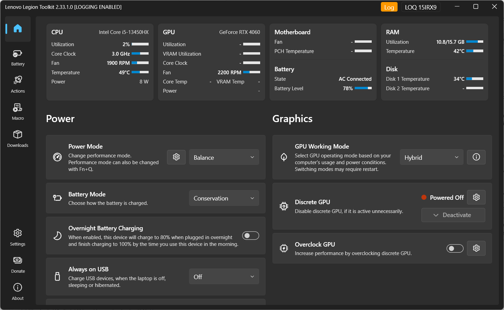 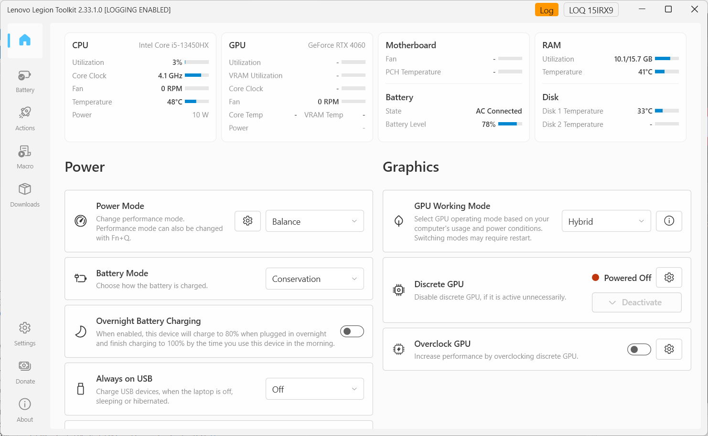

### Страницы
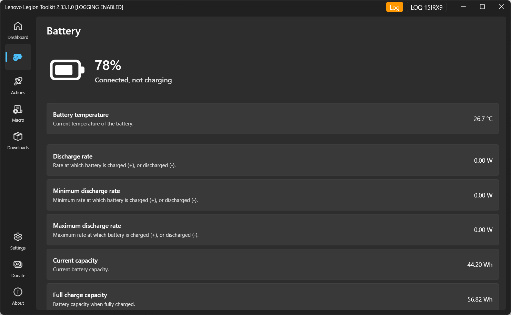 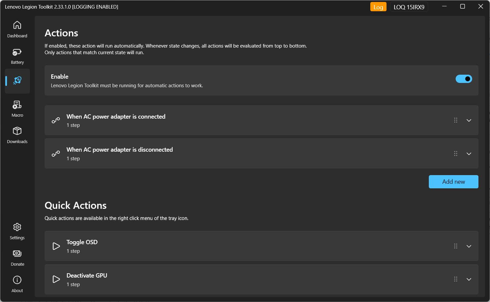
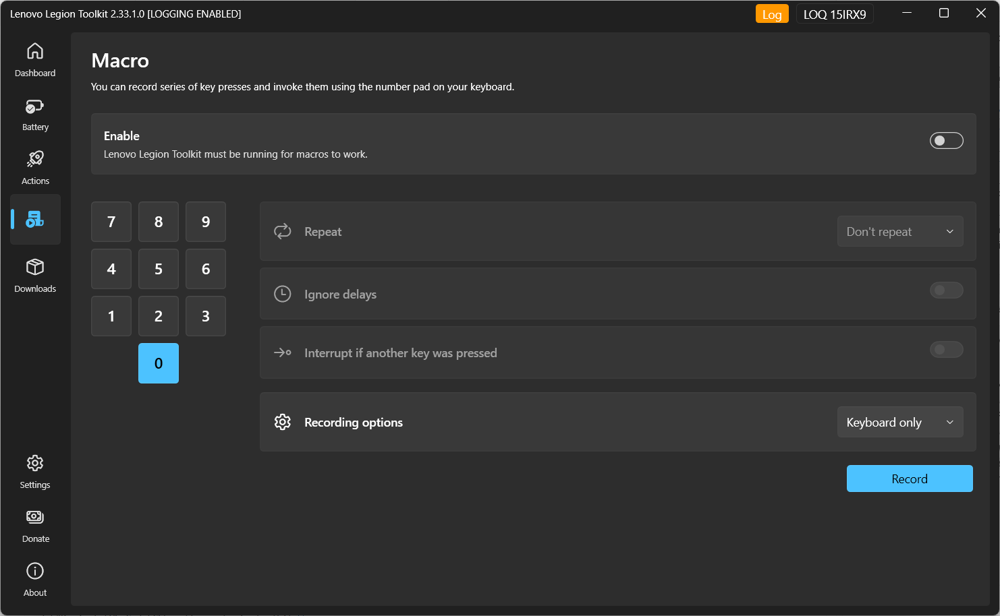

### Клавиатура и подсветка
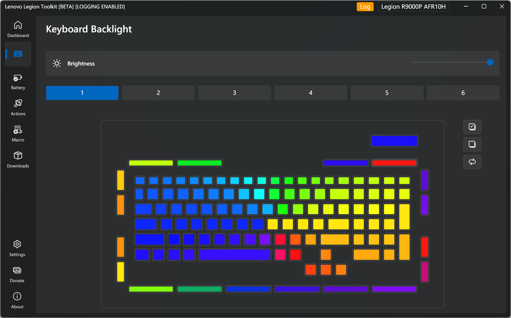 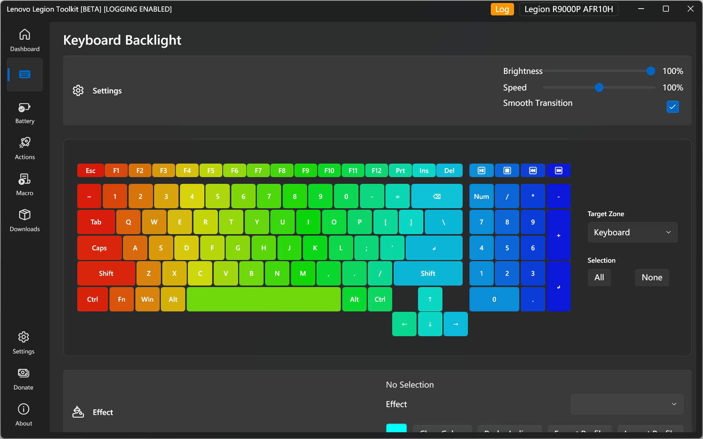

### Экранное отображение (OSD)

### Настройки
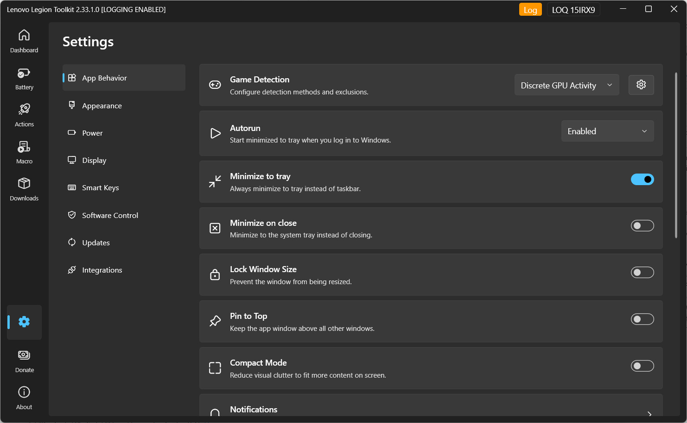 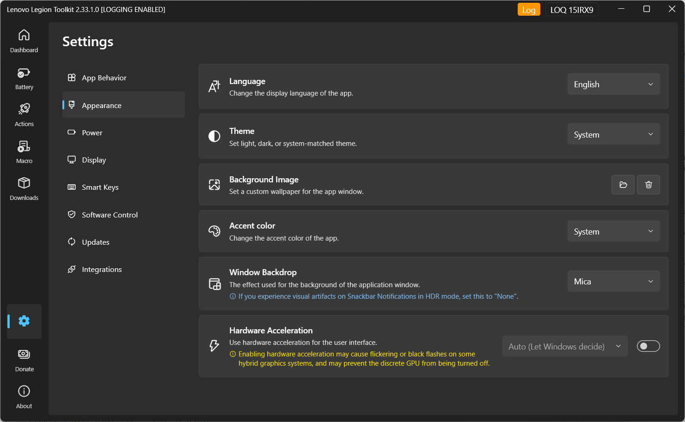
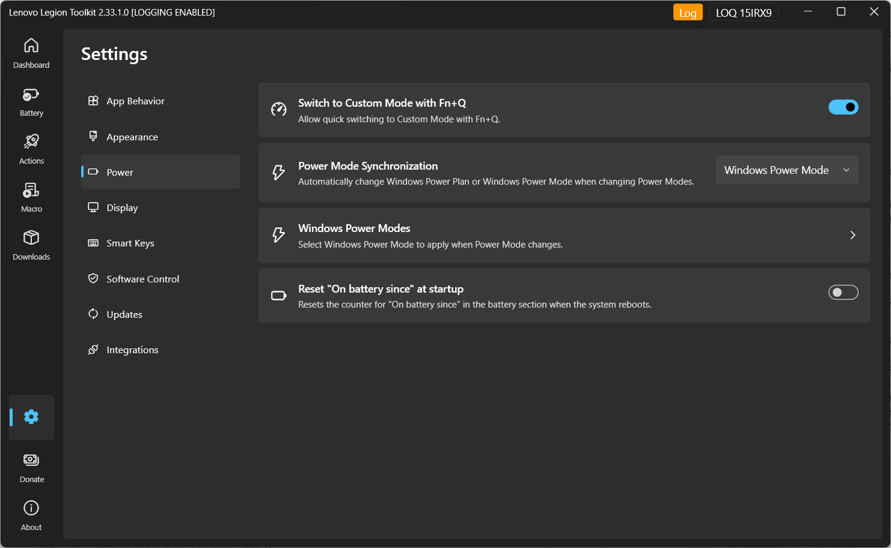 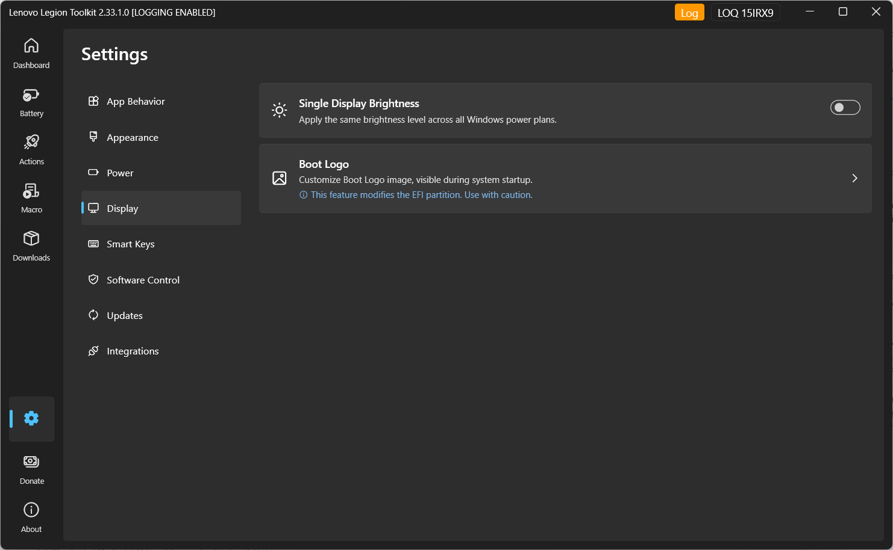
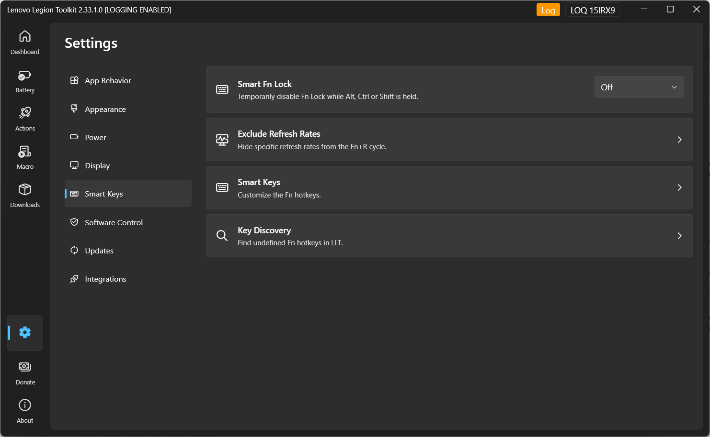 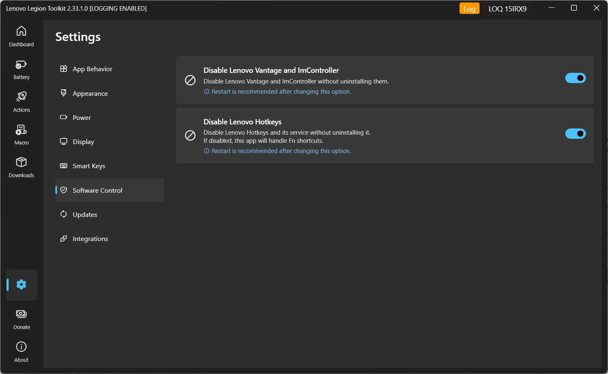
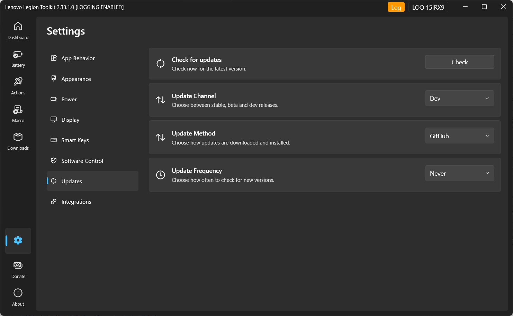 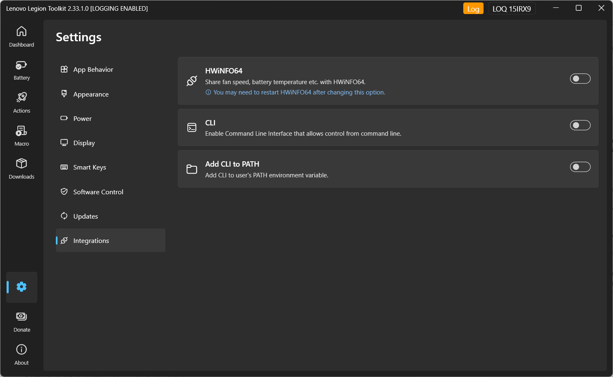

---

# Содержание
- [Локализация](#локализация)
- [Скриншоты](#скриншоты)
- [Отказ от ответственности](#отказ-от-ответственности)
- [Скачивание](#скачивание)
- [Совместимость](#совместимость)
- [Возможности](#возможности)
- [Пожертвования](#пожертвования)
- [Благодарности](#благодарности)
- [ЧАВО](#чаво)
- [Аргументы](#аргументы)
- [Как собрать логи?](#как-собрать-логи)
- [Вопросы?](#вопросы)
- [Вклад в проект](#вклад-в-проект)

## Отказ от ответственности

**Инструмент предоставляется без гарантии. Используйте на свой страх и риск.**

Пожалуйста, проявите терпение и внимательно изучите данный README — он содержит важную информацию.

## Скачивание

Программу можно скачать следующими способами:

- Со страницы [официальных релизов](https://github.com/LenovoLegionToolkit-Team/LenovoLegionToolkit/releases/latest)
  
> [!TIP] 💡 Совет
> Если вы ищете альтернативу Vantage для Linux, ознакомьтесь с проектом [LenovoLegionLinux](https://github.com/johnfanv2/LenovoLegionLinux).

#### Следующие шаги

LLT работает оптимально в фоновом режиме. Перейдите в Настройки и включите «Автозапуск» и «Сворачивать при закрытии». Затем либо отключите Vantage и Hotkeys, либо удалите их. После этого LLT будет запускаться при старте системы и возьмёт на себя все функции управления, ранее выполнявшиеся приложениями Lenovo.

> [!WARNING] ⚠️ Внимание
> Если полностью закрыть LLT, часть функций перестанет работать: синхронизация режимов/планов электропитания Windows, макросы и действия. Это связано с тем, что LLT не создаёт фоновых служб и не сможет реагировать на системные изменения в закрытом состоянии.

#### Необходимые драйверы

При установке LLT на чистую Windows убедитесь, что установлены необходимые драйверы. При их отсутствии некоторые опции могут быть недоступны. Обязательно проверьте наличие:
- Lenovo Energy Management
- Lenovo Vantage Gaming Feature Driver

> [!NOTE] 📌 Примечание
> Эти драйверы не требуются на ноутбуках 10-го поколения и новее.

#### Проблемы с .NET?

Если установщик LLT не настроил .NET корректно:
1. Перейдите на [https://dotnet.microsoft.com/en-us/download/dotnet/9.0](https://dotnet.microsoft.com/en-us/download/dotnet/9.0)
2. Найдите раздел «.NET Desktop Runtime»
3. Скачайте установщик x64 для Windows
4. Запустите установщик

> [!NOTE] 📌 Примечание
> При установке через Scoop .NET 9 должен установиться автоматически как зависимость. В случае ошибок выполните `scoop update` и переустановите LLT с флагом `--force`.

После этого откройте Терминал и введите: `dotnet --info`. В выводе найдите раздел `.NET runtimes installed`. Вы должны увидеть строки вида:

`Microsoft.NETCore.App 9.0.0 [C:\Program Files\dotnet\shared\Microsoft.NETCore.App]`

и

`Microsoft.WindowsDesktop.App 9.0.0 [C:\Program Files\dotnet\shared\Microsoft.WindowsDesktop.App]`

Точная версия может отличаться, но мажорная версия должна быть `9.x.x`. Если после этих шагов LLT всё ещё сообщает об ошибке .NET, проблема в конфигурации вашей системы, а не в утилите.

#### Хотите помочь с тестированием?

Присоединяйтесь к [Официальному Discord](https://discord.gg/TB3ER8ZVdt) для получения обновлений через каналы:
- `#stable-updates` — уведомления о стабильных релизах.
- `#beta-builds` — предрелизные версии для тестирования.
- `#dev-snapshots` — экспериментальные сборки из ветки разработки.

На сервере также принимаются баг-репорты, запросы функций и обсуждения по железу.

Вы также можете найти нас в:
- [Legion Series Discord](https://discord.com/invite/legionseries) (канал `#legion-toolkit`)
- [LOQ Series Discord](https://discord.gg/3GKzQtwdNf) (канал `#legion-toolkit`)

## Совместимость

Lenovo Legion Toolkit создан для ноутбуков серий Lenovo Legion, Legion Go, IdeaPad Gaming, LOQ, Lenovo Slim и ThinkBook, включая их китайские варианты (R-серия, Y-серия).

Поддерживаются поколения 6 (2021), 7 (2022), 8 (2023), 9 (2024), 10 (2025) и 11 (2026), хотя отдельные функции также работают на устройствах 5-го поколения (2020). Проблемы с устройствами старше 6-го поколения или не входящими в указанные линейки выходят за рамки поддержки проекта.

При получении сообщения о несовместимости при запуске ознакомьтесь с разделом «Вклад в проект» внизу файла. Помните: у нас нет доступа ко всему спектру железа Lenovo, поэтому 100% совместимость не гарантируется.

**Поддержка ноутбуков других производителей не планируется.**

### Программное обеспечение Lenovo

Рекомендуется отключить или удалить Vantage, Hotkeys и Legion Zone при использовании LLT. Совместная работа может вызывать конфликты или некорректное выполнение функций.

> [!TIP] 💡 Совет
> Использование встроенной в LLT опции отключения служб часто является самым простым решением.

### Другие замечания

LLT не поддерживает установку для нескольких пользователей. На системах с несколькими учётными записями возможны ошибки. Также требуются права администратора: установка в стандартную учётную запись приведёт к некорректной работе утилиты.

## Возможности

Приложение позволяет:
- Изменять настройки (режим питания, режим зарядки АКБ и др.), доступные только через Vantage.
- Управлять подсветкой: Spectrum per-key RGB, 4-зонной RGB и белой подсветкой.
- Мониторить активность dGPU (только NVIDIA).
- Настраивать экранное меню (OSD) для мониторинга показателей системы в реальном времени.
- Задавать действия, выполняемые при определённых условиях (например, при подключении к сети).
- Просматривать статистику аккумулятора.
- Управлять функциями ноутбука через командную строку.
- Проверять наличие обновлений драйверов и ПО.
- Проверять статус гарантии.
- Включать/отключать службы Lenovo Vantage, Legion Zone и Hotkeys без удаления.
- ... и многое другое!

### Custom Mode

Режим Custom доступен на поддерживаемых устройствах. Он отображается в списке режимов питания как 4-й вариант и позволяет настраивать лимиты мощности и вентиляторы. Нельзя активировать сочетанием Fn+Q. Набор функций зависит от модели.

Если у вас один из следующих BIOS:
- G9CN (24 или выше)
- GKCN (46 или выше)
- H1CN (39 или выше)
- HACN (31 или выше)
- HHCN (20 или выше)

Обновите его как минимум до указанной версии для корректной работы Custom Mode.

### RGB и подсветка

Поддерживается Spectrum per-key RGB и 4-зонная RGB. Службы Vantage должны быть отключены во избежание конфликтов. При использовании стороннего RGB-ПО см. [ЧАВО](#чаво).

Поддерживаются белая подсветка (1 и 3 уровня), логотип на панели и задние порты. Ограничения:
- GKCN54WW и ниже — часть функций отключена из-за бага BIOS, вызывающего BSOD.
- Некоторые модели (преимущественно 6-го поколения) могут не показывать опции или показывать несуществующие из-за некорректных таблиц BIOS.

Подсветка, требующая Corsair iCue, не поддерживается.

> [!IMPORTANT] ❗ Важно
> Riot Vanguard DRM (используется, например, в Valorant) вызывает проблемы с управлением RGB. Если настройки RGB отсутствуют при установленном античите, отключите его автозапуск или удалите.

### Hybrid Mode и режимы работы GPU

> [!NOTE] 📌 Примечание
> Опции Hybrid Mode / GPU Working Mode не являются Advanced Optimus и работают отдельно от него.

Основные способы использования dGPU:
- **Hybrid mode включён** — дисплей подключён к iGPU. dGPU активируется при нагрузке и отключается в простое, экономя батарею.
- **Hybrid mode выключен (aka dGPU)** — дисплей подключён напрямую к dGPU. Максимальная производительность, минимальное время работы от АКБ.

Переключение требует перезагрузки.

На ноутбуках 7-го и 8-го поколений доступны дополнительные настройки:
- **Hybrid iGPU-only** — dGPU полностью отключается (аналог извлечения флешки), что исключает фоновое потребление.
- **Hybrid Auto** — автоматическое отключение dGPU на батарее и подключение при подключении БП.

dGPU может не отключиться (и в большинстве случаев действительно не отключается), если она используется. Это включает приложения, использующие dGPU, подключённый внешний монитор и другие не указанные Lenovo сценарии. При использовании «Deactivate GPU» убедитесь, что статус «dGPU Powered Off» и внешние экраны отключены, перед сменой Hybrid Mode.

Настройки используют функции EC. Их стабильность зависит от прошивки Lenovo. Изменения применяются не мгновенно. LLT блокирует частые переключения и предпринимает дополнительные попытки пробудить dGPU. Ожидание может занять до 10 секунд.

При возникновении проблем попробуйте экспериментальный метод переключения GPU Working Mode — см. раздел [Аргументы](#аргументы).

> [!WARNING] ⚠️ Внимание
> Отключение dGPU через Диспетчер устройств НЕ отключает чип и приведёт к высокому энергопотреблению!

### Деактивация дискретной GPU NVIDIA

Иногда dGPU остаётся активной после закрытия нагрузки (например, при отключении внешнего монитора).

Способы деактивации:
- Завершение всех процессов на dGPU (работает стабильнее).
- Кратковременное отключение dGPU, принудительно переводящее процессы на iGPU.

Кнопка Deactivate активна при включённом Hybrid mode, отсутствии внешних мониторов и активности dGPU. При наведении показывается P-состояние и список процессов.

> [!NOTE] 📌 Примечание
> Некоторые приложения могут аварийно завершаться при использовании опции деактивации dGPU.

### Разгон дискретных NVIDIA GPU

Опция предназначена для базового разгона, аналогичного Vantage. Не заменяет Afterburner.
- Убедитесь, что разгон GPU включён в BIOS (если опция доступна).
- Разгон не работает при запущенных в фоне Vantage или Legion Zone.
- Не рекомендуется использовать одновременно с другими утилитами разгона.
- При кастомизации Dashboard может потребоваться добавить элемент управления вручную.

### Планы электропитания Windows и режим питания Windows

Режим питания в LLT (или Fn+Q) не совпадает с планами электропитания (Панель управления) или режимом питания (Настройки Windows).

**Современный подход**: использовать режимы питания Windows и единственный план «Сбалансированный». Доступны 3 режима:
- Лучшая энергоэффективность
- Сбалансированный
- Лучшая производительность

Их можно привязать к режимам Legion (Quiet, Balance, Performance, Custom) в настройках LLT. При смене режима Legion Windows автоматически переключит соответствующий режим питания.

**Устаревший подход**: использование нескольких планов электропитания. Если вы используете свои планы, оставьте настройки Windows на «Сбалансированный» и настройте LLT на автоматическое переключение планов.

При проблемах синхронизации сбросьте настройки питания командой: `powercfg -restoredefaultschemes; shutdown /r /t 0`. Все кастомные планы будут удалены, кроме стандартного «Сбалансированный (рекомендуется)».

### Boot Logo

На некоторых моделях можно изменить загрузочный логотип. Он хранится не в UEFI, а на UEFI-разделе загрузочного диска. LLT проверяет разрешение, формат и контрольную сумму. Финальная проверка происходит при загрузке: UEFI попытается отобразить изображение. При ошибке будет использован стандартный логотип. Если изображение не отображается, попробуйте другое, отредактированное в ином графическом редакторе.

### Запуск программ или скриптов из действий

В шаге «Run» можно запускать любые программы или скрипты. Укажите путь к `.exe` или `.bat`. При необходимости добавьте аргументы, как при запуске из командной строки.

Примеры

**Выключение ноутбука**
- Путь: `shutdown`
- Аргументы: `/s /t 0`

**Перезагрузка ноутбука**
- Путь: `shutdown`
- Аргументы: `/r`

**Запуск программы**
- Путь: `C:\path\to\the\program.exe` (если в PATH, можно указать только имя)
- Аргументы: (опционально)

**Запуск скрипта**
- Путь: `C:\path\to\the\script.bat`
- Аргументы: (опционально)

**Python-скрипт**
- Путь: `C:\path\to\python.exe` (или `python`, если в PATH)
- Аргументы: `C:\path\to\script.py`

### Переменные окружения

LLT автоматически передаёт переменные в окружение запускаемого процесса. Их можно использовать в скриптах.

Переменные окружения

**При подключении БП**
- `LLT_IS_AC_ADAPTER_CONNECTED=TRUE`

**При подключении БП низкой мощности**
- `LLT_IS_AC_ADAPTER_CONNECTED=TRUE`
- `LLT_IS_AC_ADAPTER_LOW_POWER=TRUE`

**При отключении БП**
- `LLT_IS_AC_ADAPTER_CONNECTED=FALSE`

**При изменении режима питания:**
- `LLT_POWER_MODE=<value>`, где `value` принимает одно из значений: `1` — Quiet, `2` — Balance, `3` — Performance, `223` — Extreme, `255` — Custom
- `LLT_POWER_MODE_NAME=<value>`, где `value` принимает одно из значений: `QUIET`, `BALANCE`, `PERFORMANCE`, `EXTREME`, `CUSTOM`

**При запуске игры**
- `LLT_IS_GAME_RUNNING=TRUE`

**При закрытии игры**
- `LLT_IS_GAME_RUNNING=FALSE`

**При запуске приложения**
- `LLT_PROCESSES_STARTED=TRUE`
- `LLT_PROCESSES=<value>`, где `value` — список имён процессов через запятую

**При закрытии приложения**
- `LLT_PROCESSES_STARTED=FALSE`
- `LLT_PROCESSES=<value>`

**Крышка открыта / закрыта**
- `LLT_IS_LID_OPEN=TRUE` / `LLT_IS_LID_OPEN=FALSE`

**Дисплеи включены / выключены**
- `LLT_IS_DISPLAY_ON=TRUE` / `LLT_IS_DISPLAY_ON=FALSE`

**Внешний дисплей подключён / отключён**
- `LLT_IS_EXTERNAL_DISPLAY_CONNECTED=TRUE` / `LLT_IS_EXTERNAL_DISPLAY_CONNECTED=FALSE`

**HDR включён / выключен**
- `LLT_IS_HDR_ON=TRUE` / `LLT_IS_HDR_ON=FALSE`

**Wi-Fi подключён / отключён**
- `LLT_WIFI_CONNECTED=TRUE`
- `LLT_WIFI_SSID=<value>`
- `LLT_WIFI_CONNECTED=FALSE`

**В указанное время**
- `LLT_IS_SUNSET=<value>`, `LLT_IS_SUNRISE=<value>` (`TRUE`/`FALSE`)
- `LLT_TIME=<value>` (`HH:mm`)
- `LLT_DAYS=<value>` (список дней недели)

**Периодическое действие**
- `LLT_PERIOD=<value>` (интервал в секундах)

**При запуске / возобновлении**
- `LLT_STARTUP=TRUE`
- `LLT_RESUME=TRUE`

**При изменении Hybrid Mode:**
- `LLT_HYBRID_MODE=<value>`, где `value` принимает одно из значений: `1` — dGPU Only, `2` — Hybrid, `3` — Hybrid Auto, `4` — Hybrid IGPU Only, `5` — UMA
- `LLT_HYBRID_MODE_NAME=<value>`, где `value` принимает одно из значений: `DGPU Only`, `Hybrid`, `Hybrid Auto`, `Hybrid IGPU`, `UMA`

**При подключении / отключении устройства**
- `LLT_DEVICE_CONNECTED=TRUE` / `LLT_DEVICE_CONNECTED=FALSE`
- `LLT_DEVICE_INSTANCE_IDS=<value>`

**Пользователь активен / неактивен**
- `LLT_IS_USER_ACTIVE=TRUE` / `LLT_IS_USER_ACTIVE=FALSE`

**Сеанс заблокирован / разблокирован**
- `LLT_SESSION_LOCKED=TRUE` / `LLT_SESSION_LOCKED=FALSE`

### Вывод

Если отмечено «Wait for exit», LLT захватит вывод `stdout`. Он сохраняется в `$RUN_OUTPUT$` и может быть показан в шаге «Show notification».

### CLI

Управлять функциями LLT можно из командной строки. Исполняемый файл: `llt.exe` (в каталоге установки).

Для работы CLI LLT должен работать в фоне, опция CLI должна быть включена в настройках. Можно добавить `llt.exe` в PATH.

Запуск от администратора не требуется.

Команды

- `llt quickAction --list` — список всех быстрых действий
- `llt quickAction <name>` — выполнить быстрое действие
- `llt feature --list` — список всех поддерживаемых функций
- `llt feature get <name>` — получить значение функции
- `llt feature set <name> --list` — список всех значений для функции
- `llt feature set <name> <value>` — установить значение функции
- `llt spectrum profile get` — получить текущий профиль Spectrum RGB
- `llt spectrum profile set <profile>` — установить профиль Spectrum RGB
- `llt spectrum brightness get` — получить текущую яркость Spectrum RGB
- `llt spectrum brightness set <brightness>` — установить яркость Spectrum RGB
- `llt rgb get` — получить текущий пресет 4-зонной RGB
- `llt rgb set <preset>` — установить пресет 4-зонной RGB

## Пожертвования

Если вам нравится использовать LLT, поддержите проект через кнопку GitHub Sponsors на странице репозитория.

## Благодарности

LLT изначально создан Bartosz Cichecki ([GitHub](https://github.com/BartoszCichecki)). С момента архивации репозитория проект развивается командой LenovoLegionToolkit-Team (Kaguya и Dr. Skinner).

Отдельная благодарность:
- [ViRb3](https://github.com/ViRb3) — за [Lenovo Controller](https://github.com/ViRb3/LenovoController), ставший основой.
- [falahati](https://github.com/falahati) — за [NvAPIWrapper](https://github.com/falahati/NvAPIWrapper) и [WindowsDisplayAPI](https://github.com/falahati/WindowsDisplayAPI).
- [tebjan](https://github.com/tebjan/NvAPIWrapper) — за обновление NVAPIWrapper.
- [SmokelessCPU](https://github.com/SmokelessCPU) — за помощь с 4-зонной RGB и Spectrum.
- [Mario Bălănică](https://github.com/mariobalanica) — за все вклады.
- [Ace-Radom](https://github.com/Ace-Radom) — за все вклады.
- [fan](https://github.com/Undervoltologist) — за реверс-инжиниринг EC.

### Сторонние библиотеки

LLT использует open-source библиотеки:

**Основной UI и фреймворк:**
- WPF-UI ([lepoco/wpfui](https://github.com/lepoco/wpfui))
- Autofac ([autofac/Autofac](https://github.com/autofac/Autofac))
- Humanizer ([Humanizr/Humanizer](https://github.com/Humanizr/Humanizer))
- Markdig ([xoofx/markdig](https://github.com/xoofx/markdig)) & Markdig.Wpf ([Kryptos-FR/markdig.wpf](https://github.com/Kryptos-FR/markdig.wpf))

**Системы и оборудование:**
- RAMSPDToolkit ([Blacktempel/RAMSPDToolkit](https://github.com/Blacktempel/RAMSPDToolkit))
- LibreHardwareMonitor ([LibreHardwareMonitor/LibreHardwareMonitor](https://github.com/LibreHardwareMonitor/LibreHardwareMonitor))
- PawnIO ([namazso/PawnIO](https://github.com/namazso/PawnIO))
- CoordinateSharp ([Tronald/CoordinateSharp](https://github.com/Tronald/CoordinateSharp))
- ZenStates-Core ([irusanov/ZenStates-Core](https://github.com/irusanov/ZenStates-Core))
- PresentMonFps ([lemutec/PresentMonFps](https://github.com/lemutec/PresentMonFps))

**Утилиты:**
- Newtonsoft.Json ([JamesNK/Newtonsoft.Json](https://github.com/JamesNK/Newtonsoft.Json))
- Octokit ([octokit/octokit.net](https://github.com/octokit/octokit.net))
- TaskScheduler ([dahall/TaskScheduler](https://github.com/dahall/TaskScheduler))
- ManagedNativeWifi ([emoacht/ManagedNativeWifi](https://github.com/emoacht/ManagedNativeWifi))
- PubSub ([upta/pubsub](https://github.com/upta/pubsub))
- NeoSmart.AsyncLock ([neosmart/AsyncLock](https://github.com/neosmart/AsyncLock))
- System.CommandLine ([dotnet/command-line-api](https://github.com/dotnet/command-line-api))
- NAudio.Wasapi ([naudio/NAudio](https://github.com/naudio/NAudio))
- Ben.Demystifier ([benaadams/Ben.Demystifier](https://github.com/benaadams/Ben.Demystifier))

**Визуалы и помощники UI:**
- PixiEditor.ColorPicker ([PixiEditor/ColorPicker](https://github.com/PixiEditor/ColorPicker))
- WpfScreenHelper ([micdenny/WpfScreenHelper](https://github.com/micdenny/WpfScreenHelper))

Полный список сторонних компонентов и лицензий см. в файле [NOTICE](NOTICE).

### Переводы предоставлены:
- Болгарский — [Ekscentricitet](https://github.com/Ekscentricitet)
- Китайский (упр.) — [凌卡Karl](https://github.com/KarlLee830), [Ace-Radom](https://github.com/Ace-Radom)
- Китайский (трад.) — [flandretw](https://github.com/flandretw)
- Чешский — J0sef
- Голландский — Melm, [JarneStaalPXL](https://github.com/JarneStaalPXL)
- Французский — EliotAku, [Georges de Massol](https://github.com/jojo2massol), Rigbone, ZeroDegree
- Немецкий — Sko-Inductor, Running_Dead89
- Греческий — GreatApo
- Итальянский — [Lampadina17](https://github.com/Lampadina17)
- Каракалпакский — KarLin, Gulnaz, Niyazbek Tolibaev, Shingis Joldasbaev
- Латышский — RJSkudra
- Румынский — [Mario Bălănică](https://github.com/mariobalanica)
- Словацкий — Mitschud, Newbie414
- Испанский — M.A.G.
- Польский — Mariusz Dziemianowicz
- Португальский — dvsilva
- Португальский (Бразилия) — Vernon
- **Русский — [Edward Johan](https://github.com/younyokel)**
- Турецкий — Undervolt
- Украинский — [Vladyslav Prydatko](https://github.com/va1dee), [Dmytro Zozulia](https://github.com/Nollasko)
- Вьетнамский — Not_Nhan, Kuri, Nagidrop

Благодарность всем, кто отслеживает и исправляет переводы!

## ЧАВО

**Почему появляется сообщение, что Vantage всё ещё работает, хотя он удалён?**

С версии 2.14.0 LLT строго проверяет оставшиеся процессы Vantage. Он устанавливает 3 компонента:

1. Приложение Lenovo Vantage
2. Служба Lenovo Vantage Service
3. System Interface Foundation V2 Device

Проще всего перейти в настройки LLT и выбрать опции отключения Lenovo Vantage, Legion Zone и Hotkeys (отображаются только установленные компоненты).

Если вы хотите полностью удалить их, убедитесь, что удалены все 3 компонента — иначе некоторые опции в LLT будут недоступны. Проверьте Диспетчер задач на наличие процессов с `Vantage` или `ImController`. Также ознакомьтесь с инструкцией: [Uninstalling System Interface Foundation V2 Device](https://support.lenovo.com/us/en/solutions/HT506070), если у вас возникли проблемы с удалением процессов `ImController`.

**Почему антивирус сообщает о вирусе/трояне?**

LLT использует низкоуровневые Windows API, что вызывает ложные срабатывания. Исходный код открыт для аудита. Установщики собираются через GitHub Actions. Исполняемые файлы подписаны сертификатом проекта для проверки подлинности. При скачивании с GitHub предупреждение является ложным.

**Могу ли я настроить горячие клавиши?**

Горячие клавиши настраиваются в настройках LLT.

**Могу ли я настроить порог Conservation mode?**

Нет. Порог зашит в прошивке: 60% (2021 и ранее) или 80% (2022 и позже). Изменить невозможно.

**Могу ли я настроить вентиляторы в режимах Quiet, Balance или Performance?**

Нет. Настройка вентиляторов доступна только в Custom Mode.

**Почему нельзя переключиться на Performance, Extreme или Custom от батареи?**

С версии 2.11.0 поведение LLT синхронизировано с Vantage/Legion Zone. При необходимости используйте аргумент `--allow-all-power-modes-on-battery`. См. раздел [Аргументы](#аргументы).

> [!WARNING] ⚠️ Внимание
> Лимиты мощности применяются некорректно при работе от батареи. Ожидается нестабильное поведение. Поддержка при использовании данного аргумента не предоставляется.

**Почему переключение в Performance глючит при включённом AI Engine?**

Некоторые версии BIOS имеют конфликты при использовании Fn+Q. Ожидается обновление от Lenovo.

**Почему появляется сообщение о несовместимости после замены материнской платы?**

Новая плата может не содержать корректных номеров модели/серийников. Восстановите их по [инструкции](https://laptopwiki.eu/laptopwiki/guides/lenovo/legion_bios_lvarrecovery). В обход используйте аргумент `--skip-compat-check`. См. раздел [Аргументы](#аргументы).

**Почему игра не обнаруживается?**

Режим обнаружения настраивается в LLT. Варианты:
- **Auto (по умолчанию)** — комбинация методов ниже
- **Discrete GPU** — реакция на использование dGPU
- **Game Config Store** — реакция на игры в реестре Windows (`HKEY_CURRENT_USER\System\GameConfigStore\Children`). Пометить программу как игру можно в Xbox Game Bar (Win+G)
- **Game Mode** — реакция на активацию Игрового режима Windows

Убедитесь, что игра соответствует критериям выбранного режима.

**Можно ли использовать другое RGB-ПО?**

Да. При работающем Vantage LLT отключает управление RGB. Для стороннего ПО используйте аргументы `--force-disable-rgbkb` или `--force-disable-spectrumkb`. См. раздел [Аргументы](#аргументы).

**Будут ли поддерживаться клавиатуры iCue RGB?**

Нет. Рекомендуется [OpenRGB](https://openrgb.org/).

**Можно ли добавить больше RGB-эффектов?**

Только аппаратно поддерживаемые эффекты. Кастомные эффекты не планируются. См. [L5P-Keyboard-RGB](https://github.com/4JX/L5P-Keyboard-RGB) или [OpenRGB](https://openrgb.org/).

**Можете ли вы добавить управление вентиляторами для других моделей?**

Доступно на Gen 7 и новее. Старые модели не поддерживаются из-за технических ограничений. Обсуждения в [Официальном Discord](https://discord.gg/TB3ER8ZVdt).

**Почему нет подсказки при наведении на значок в трее?**

Изменения в трее Windows 10/11 Microsoft иногда ломают кастомные подсказки. Решение: обновите Windows.

**Как разогнать/андервольтнуть CPU?**

Используйте [Intel XTU](https://www.intel.com/content/www/us/en/download/17881/intel-extreme-tuning-utility-intel-xtu.html) или [ThrottleStop](https://www.techpowerup.com/download/techpowerup-throttlestop/).

**Что, если я слишком сильно разогнал GPU?**

Если система нестабильна:
- Отключите «GPU Overclocking» в BIOS, загрузите Windows, включите обратно.
- Загрузитесь в безопасном режиме и удалите `gpu_oc.json` из `"%LOCALAPPDATA%\LenovoLegionToolkit"`.

**Почему Boot Logo не применяется?**

При изменении Boot Logo LLT проверяет правильность формата и разрешения. Если LLT сообщает об успешном применении логотипа, значит, настройка была корректно сохранена в UEFI. Если кастомный логотип не отображается при загрузке, это означает, что хотя UEFI настроен и изображение сохранено на UEFI-раздел, ваш UEFI по какой-то причине не отображает его. В таком случае попробуйте другое изображение, возможно, в другом формате и отредактированное в другом графическом редакторе. Если логотип по-прежнему не отображается, вероятно, проблема в версии BIOS.

**Почему заикания при использовании Smart Fn Lock?**

На некоторых BIOS переключение Fn Lock вызывает заикание. Отключите опцию «Fool proof Fn Lock» (или аналогичную) в BIOS.

**Почему нет информации о гарантии?**

В последних версиях функция удалена для китайских моделей из-за ненадёжности. Изменение не затрагивает другие регионы.

**Какое поколение у моего ноутбука?**

Проверьте номер модели (например, `16ACH6H` или `16IAX7`). Последняя цифра указывает поколение.

## Аргументы

Редко используемые функции включаются через аргументы. Передаются как параметры или в `args.txt`.

- `--trace` — логирование в `%LOCALAPPDATA%\LenovoLegionToolkit\log`
- `--minimized` — запуск свёрнутым в трей
- `--skip-compat-check` — отключение проверки совместимости (⚠️ Поддержка не предоставляется)
- `--disable-tray-tooltip` — отключение подсказки в трее
- `--allow-all-power-modes-on-battery` — все режимы питания от батареи (⚠️ Поддержка не предоставляется)
- `--enable-hybrid-mode-automation` — изменение Hybrid Mode через действия (⚠️ Поддержка не предоставляется)
- `--force-disable-rgbkb` — отключение подсветки 4-зонных RGB
- `--force-disable-spectrumkb` — отключение подсветки Spectrum per-key RGB
- `--force-disable-lenovolighting` — отключение подсветки логотипа, портов и некоторых белых клавиатур
- `--enable-lamp-array` — включение Lamp Array (Windows Dynamic Lighting)
- `--experimental-gpu-working-mode` — экспериментальный метод переключения GPU (как в Legion Zone) (⚠️ Поддержка не предоставляется)
- `--proxy-url=example.com` — URL прокси-сервера
- `--proxy-username=some_username` — имя пользователя прокси
- `--proxy-password=some_password` — пароль прокси
- `--proxy-allow-all-certs` — ослабление проверки HTTPS/SSL через прокси
- `--disable-update-checker` — отключение проверки обновлений
- `--disable-conflicting-software-warning` — отключение предупреждений о конфликтующем ПО

Для `args.txt`:
1. Перейдите в `%LOCALAPPDATA%\LenovoLegionToolkit`
2. Создайте/отредактируйте `args.txt`
3. Один аргумент на строку
4. Запустите LLT

Аргументы, не указанные выше, больше не требуются.

## Как собрать логи?

Всегда прикрепляйте логи к обращениям.

**Метод 1: Через настройки (рекомендуется)**
1. Откройте LLT → Настройки → Включите «Enable logging».
2. Воспроизведите проблему.
3. Логи сохраняются в `"%LOCALAPPDATA%\LenovoLegionToolkit\log"`.

**Метод 2: Ручной трейс (для проблем запуска)**
1. Убедитесь, что LLT полностью закрыт.
2. Нажмите `Win+R`, введите: `"%LOCALAPPDATA%\Programs\LenovoLegionToolkit\Lenovo Legion Toolkit.exe" --trace` и нажмите OK.
3. В заголовке появится `[LOGGING ENABLED]`.
4. Воспроизведите проблему и закройте приложение.
5. Нажмите `Win+R`, введите `"%LOCALAPPDATA%\LenovoLegionToolkit\log"`.

## Вопросы?

Общие вопросы задавайте в [GitHub Discussions](https://github.com/LenovoLegionToolkit-Team/LenovoLegionToolkit/discussions) или в [Официальном Discord](https://discord.gg/TB3ER8ZVdt).

## Вклад в проект

Мы ценим отзывы. Не стесняйтесь сообщать о проблемах.

Pull Requests приветствуются, но сначала ознакомьтесь с [CONTRIBUTING.md](CONTRIBUTING.md)!

### Совместимость

> [!IMPORTANT] ❗ Важно
> Если ваш ноутбук не входит в серии Legion, Legion Go, IdeaPad Gaming, LOQ, Lenovo Slim или ThinkBook, данное ПО вам не подойдёт. Не создавайте запросы на совместимость для других устройств.

Мы хотим расширить список совместимых устройств, но нужна ваша помощь!

Если готовы проверить работу LLT на неподдерживаемом устройстве, нажмите «Continue» при запуске. LLT начнёт автоматическое логирование.

Помните: некоторые функции могут работать некорректно.

Будем признательны за создание Issue на GitHub с результатами.

Укажите:
- Полное название модели (например, Legion 5 Pro 16ACH6H)
- Список работающих функций
- Список неработающих функций
- Список функций, вызывающих краш

Чем больше информации, тем лучше приложение. При аномалиях подробно опишите шаги и прикрепите логи (`%LOCALAPPDATA%\LenovoLegionToolkit\log`).

Спасибо заранее!